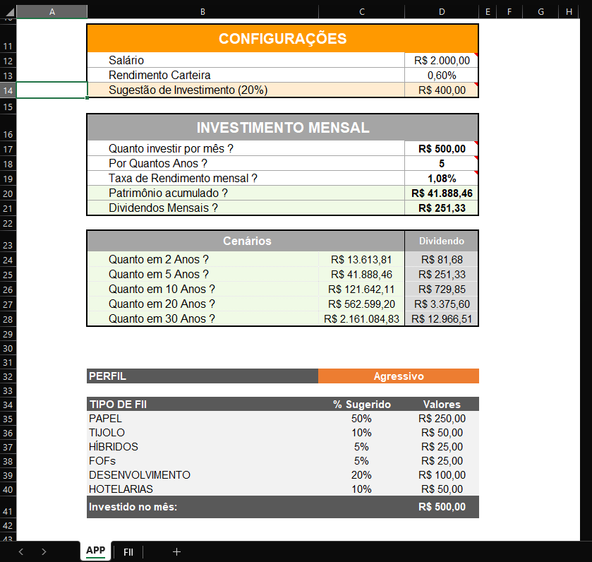

  

  <a href="#-tecnologias">Tecnologias</a>&nbsp;&nbsp;&nbsp;|&nbsp;&nbsp;&nbsp;
  <a href="#-projeto">Projeto</a>&nbsp;&nbsp;&nbsp;|&nbsp;&nbsp;&nbsp;
  <a href="#-preview">Preview</a>

 

## 🚀 Tecnologias

Esse projeto foi desenvolvido com a ferramenta microsoft [excel](https://www.microsoft.com/pt-br/microsoft-365/excel).

   
   

## 📖 Projeto

Este projeto faz parte da prática do curso [Excel com inteligência artificial]([https://ebaconline.com.br/analista-de-dados](https://web.dio.me/track/santander-excel-com-inteligencia-artificial), da plataforma Dio.me, que tem como objetivo aplicar os conceitos de Excel no desenvolvimento de uma ferramenta prática de simulação de investimentos em fundos imobiliários. A partir de uma compreensão aprofundada sobre como os fundos imobiliários funcionam e as perguntas típicas dos investidores (quanto investir, por quanto tempo, taxa de rendimento, etc.), o desafio consiste em construir uma planilha que ajude o usuário a realizar essas simulações, auxiliando-o a tomar decisões mais informadas sobre seus investimentos. A solução proposta visa automatizar cálculos complexos, como o valor total investido, o patrimônio acumulado e os dividendos mensais, proporcionando ao usuário uma visão clara de seu potencial retorno.
 
 

## 🖥 Preview

  

### Como Executar

Basta baixar o arquivo em .xlsx [aqui](https://github.com/KevynFirst/controle-de-investimento/blob/c371648ab89b7610923ecb2ee9e0967bde1ddae0/controle_de_investimento.xlsx). 👈🏻

 

## 😉 Obrigado por visitar meu projeto

Você pode conferir outros projetos que desenvolvi aqui no meu GitHub, ou entrar em contato comigo pelos demais links.

